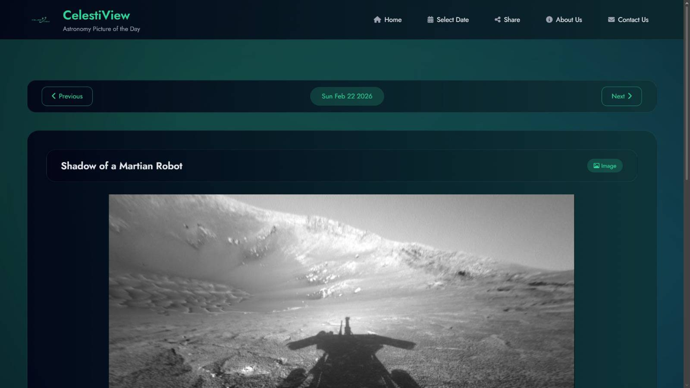
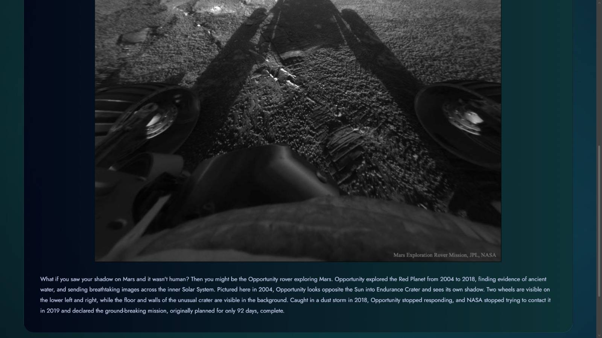
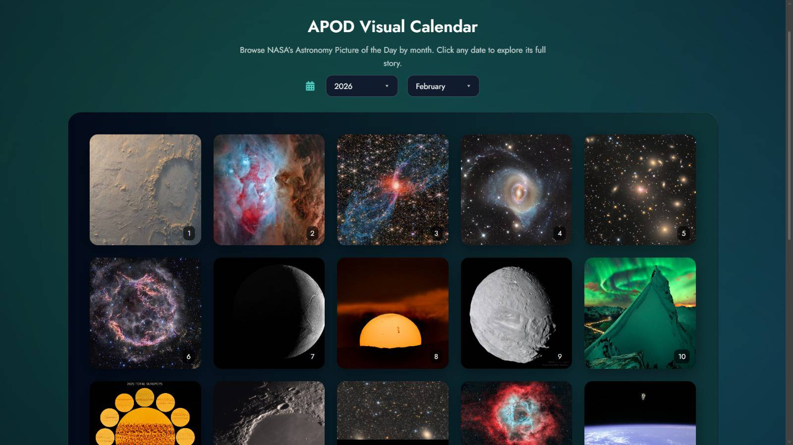
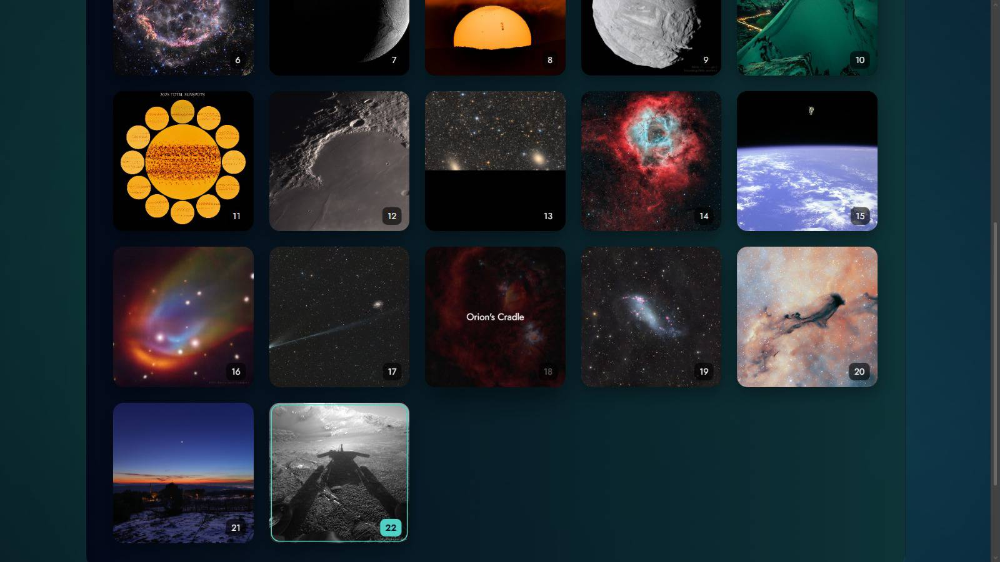
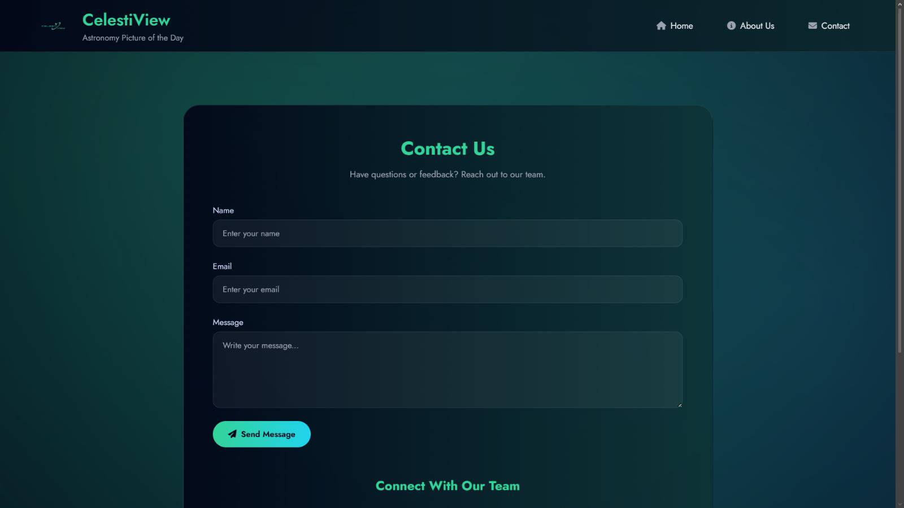

# 🌌 CelestiView

<p align="center">
  <h3 align="center">Explore the Universe with NASA's Astronomy Picture of the Day</h3>
  <p align="center">
    A modern web application that fetches and displays NASA's Astronomy Picture of the Day (APOD) using the official NASA API.
  </p>
</p>

---

## 📖 About the Project

CelestiView is a responsive web application developed as a mini project by a team of four members.

The application uses NASA's APOD API to display the Astronomy Picture of the Day along with its title, description, and date. Users can also browse previous APOD images through a calendar interface.

---

## ✨ Features

- 🚀 Fetches NASA Astronomy Picture of the Day
- 📅 Browse previous APOD images
- 📱 Fully responsive design
- 🎨 Modern and clean user interface
- ⚡ Fast and lightweight
- 🌍 Uses NASA Official API

---

## 🛠️ Tech Stack

### Frontend
- HTML5
- CSS3
- JavaScript

### Backend
- Node.js
- Express.js

### API
- NASA APOD API

---

## 📸 Screenshots
<h2 align="center">📸 Project Screenshots</h2>

<p align="center">
  
  
</p>

<p align="center">
  
  
</p>

<p align="center">
  
</p>


---

## 📂 Project Structure

```text
CelestiView/
│
├── public/
│   ├── css/
│   ├── js/
│   ├── images/
│
├── routes/
├── server.js
├── package.json
└── README.md
```

---

## ⚙️ Installation

```bash
git clone https://github.com/abhishekas10058/CelestiView.git

cd CelestiView

npm install

npm start
```

---

## 👥 Team Members

| Name | GitHub |
|------|--------|
| Abhishek | [@abhishekas10058](https://github.com/abhishekas10058) |
| Aswani J | [@Aswanij](https://github.com/Aswanij) |
| Member 3 | [@username](https://github.com/username) |
| Member 4 | [@username](https://github.com/username) |


## 📈 Future Improvements

- Dark Mode
- Save Favourite Images
- Image Download Option
- Search by Date
- Better Animations

---

## 📜 License

This project was developed for academic and educational purposes.

---

⭐ If you like this project, consider giving it a star!
